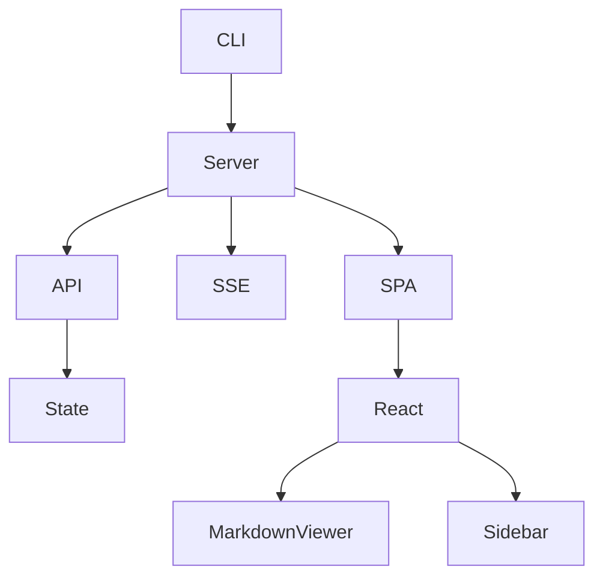

# Long Document

This file tests scrolling and rendering performance with a longer document.

## Section 1: Introduction

Lorem ipsum dolor sit amet, consectetur adipiscing elit. Nullam euismod, nisi vel consectetur interdum, nisl nisi aliquet nunc, eget aliquam nisl nisi eu nunc. Donec auctor, nisi vel consectetur interdum, nisl nisi aliquet nunc, eget aliquam nisl nisi eu nunc.

Sed do eiusmod tempor incididunt ut labore et dolore magna aliqua. Ut enim ad minim veniam, quis nostrud exercitation ullamco laboris nisi ut aliquip ex ea commodo consequat.

## Section 2: Architecture



The system consists of a Go backend and a React frontend.

### 2.1 Backend

The Go server handles:
- File management API
- Raw markdown content delivery
- SSE notifications
- Built-in SPA serving

### 2.2 Frontend

| Component | Responsibility |
|-----------|---------------|
| App | Routing, state management |
| Sidebar | File tab navigation |
| MarkdownViewer | Markdown rendering with Shiki |
| ThemeToggle | Dark/light mode switch |

## Section 3: Code Examples

### 3.1 Server Setup

```go
package server

import (
	"net/http"
	"sync"
)

type State struct {
	mu     sync.RWMutex
	groups map[string]*Group
	nextID int
}

func NewState() *State {
	return &State{
		groups: make(map[string]*Group),
	}
}
```

### 3.2 API Hook

```typescript
export async function fetchFileContent(
  fileId: number
): Promise<{ content: string; baseDir: string }> {
  const res = await fetch(`/_/api/files/${fileId}/content`);
  if (!res.ok) throw new Error("Failed to fetch");
  return res.json();
}
```

### 3.3 CSS Theme

```css
:root {
  --bg-primary: #ffffff;
  --text-primary: #24292e;
}

[data-theme="dark"] {
  --bg-primary: #0d1117;
  --text-primary: #e6edf3;
}
```

## Section 4: Task List

- [x] Project setup
- [x] CLI argument parsing
- [x] HTTP server
- [x] File management API
- [x] SSE notifications
- [x] React SPA
- [x] Markdown rendering
- [x] Syntax highlighting
- [ ] Mermaid diagrams
- [ ] Search functionality
- [ ] Export to PDF

## Section 5: FAQ

> **Q: How do I add a file to an existing session?**
>
> Run `mo another.md` in a separate terminal. It will detect the running server and add the file.

> **Q: How do I change the port?**
>
> Use the `--port` flag: `mo --port 8080 file.md`

> **Q: Can I group files?**
>
> Yes, use the `--target` flag: `mo --target docs README.md CHANGELOG.md`

## Section 6: Changelog

### v0.1.0

- Initial release
- Basic markdown rendering
- Syntax highlighting with Shiki
- Dark/light mode
- File tab management
- SSE live updates

---

*End of document*
