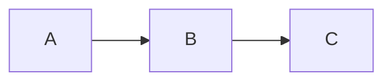

# Error Handling Test

This file contains an invalid mermaid block to verify fallback behavior.

## Valid Diagram



## Invalid Diagram

```mermaid
this is not valid mermaid syntax !!!
    --> broken {{{
```

## Normal Text After

Regular markdown continues to render correctly after an invalid mermaid block.
