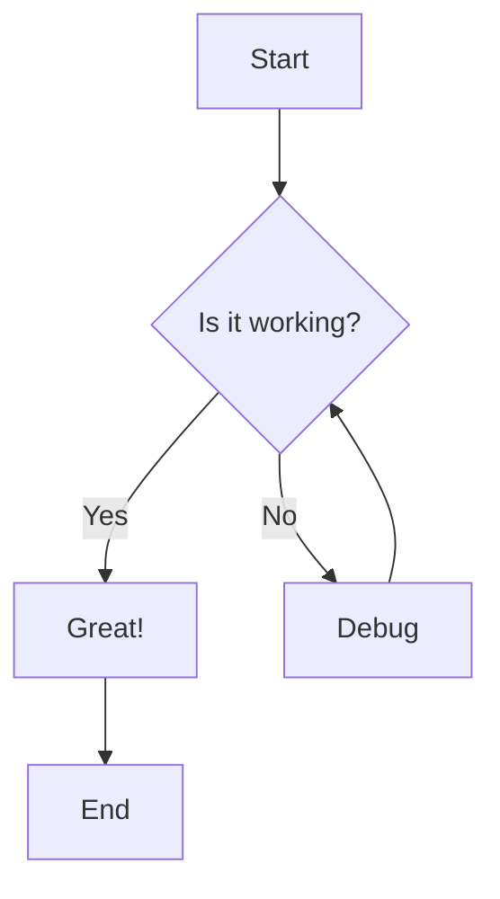
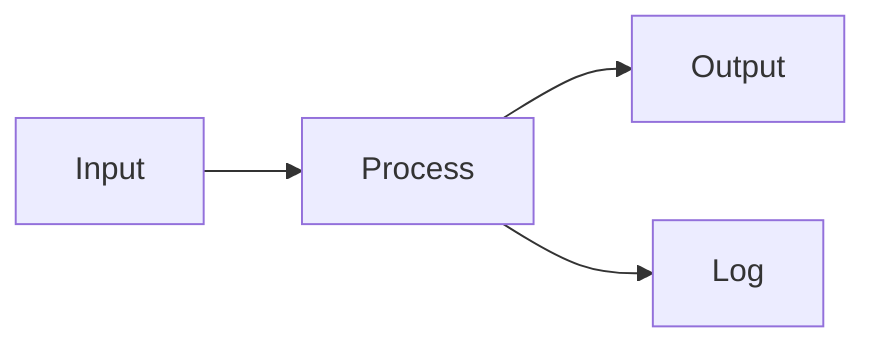

# Flowchart

```mermaid
flowchart TD
    A[Start] --> B{Is it working?}
    B -->|Yes| C[Great!]
    B -->|No| D[Debug]
    D --> B
    C --> E[End]
```

## Left to Right

```mermaid
flowchart LR
    A[Input] --> B[Process]
    B --> C[Output]
    B --> D[Log]
```
