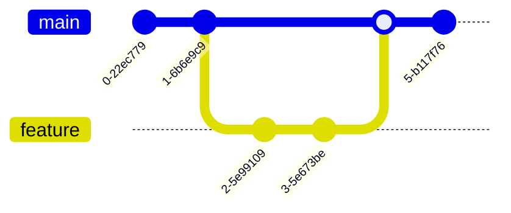
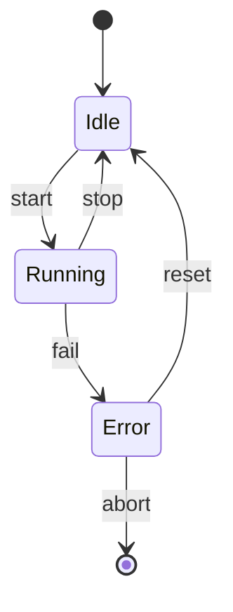

# Git Graph

```mermaid
gitGraph
    commit
    commit
    branch feature
    checkout feature
    commit
    commit
    checkout main
    merge feature
    commit
```

## State Diagram

```mermaid
stateDiagram-v2
    [*] --> Idle
    Idle --> Running : start
    Running --> Idle : stop
    Running --> Error : fail
    Error --> Idle : reset
    Error --> [*] : abort
```
