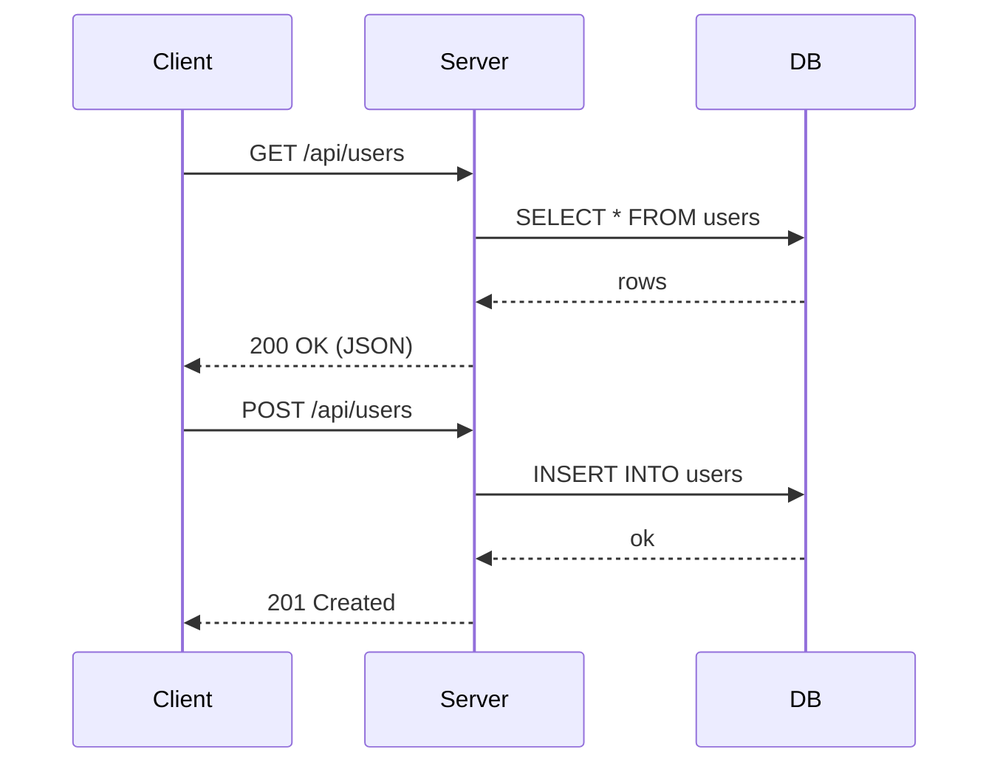

# Sequence Diagram

```mermaid
sequenceDiagram
    participant Client
    participant Server
    participant DB

    Client->>Server: GET /api/users
    Server->>DB: SELECT * FROM users
    DB-->>Server: rows
    Server-->>Client: 200 OK (JSON)

    Client->>Server: POST /api/users
    Server->>DB: INSERT INTO users
    DB-->>Server: ok
    Server-->>Client: 201 Created
```
